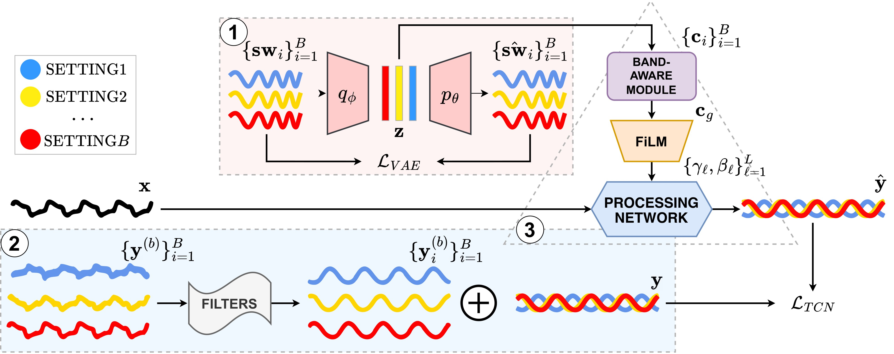
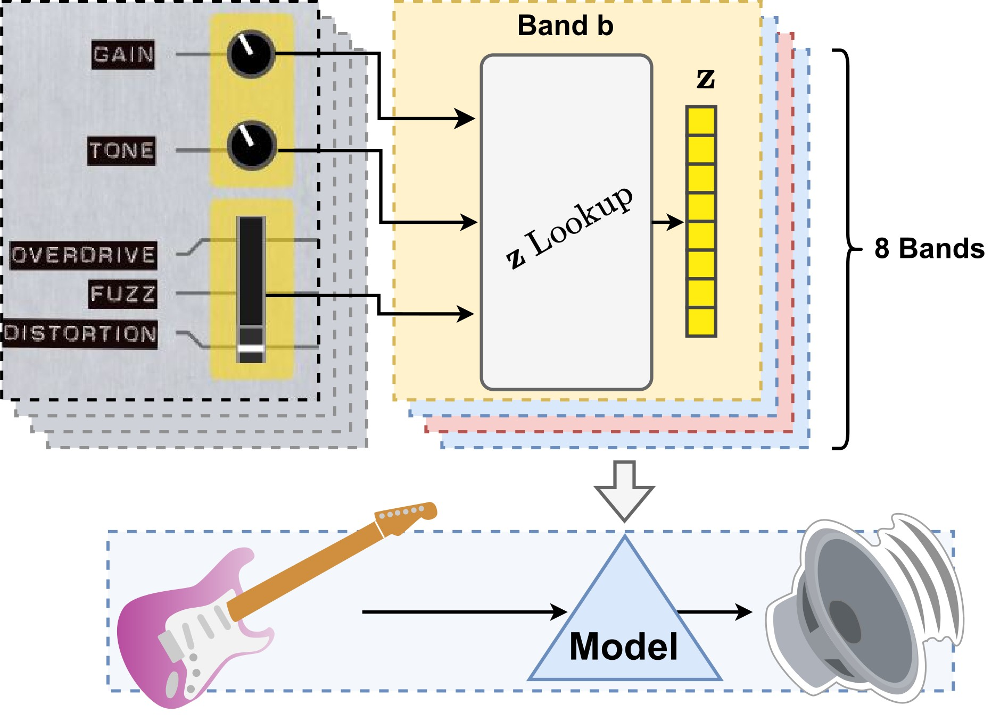
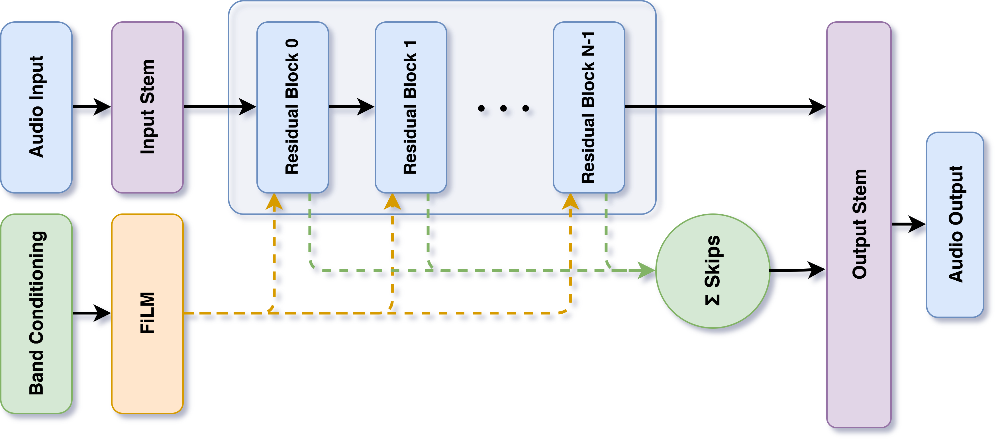

# 🧠 Prism - Neural Network
### Multiband Neural Distortion - Neural Processing Core

<div align="center">

[](https://domenicostefani.com/prism-distortion)
[](https://domenicostefani.com/prism-distortion/demos/demos-multiband.html)
[](https://github.com/domenicostefani/prism-distortion)

</div>

---

## 📑 Contents:

- [Overview](#-overview)
- [Architecture](#%EF%B8%8F-architecture)
- [Training Pipeline](#-training-pipeline)
- [Plugin Interface](#%EF%B8%8F-plugin-interface)
- [Demos](#-demos)
- [Related Links](#-related-links)

---

## 📖 Overview

This repository contains the neural network core for **Prism**, a multiband distortion audio plugin. The neural network learns complex transfer functions that model analog boutique pedals, enabling sophisticated distortion effects across multiple frequency bands.

**For the plugin GUI and interface, see the [Plugin Interface Repository](https://github.com/domenicostefani/prism-distortion).**

<div align="center">
    
</div>

### 🎯 What's Modeled

The neural network models three distinct analog distortion effects:

- **👑 Overdrive** - Modeled after a certain royalty member of the overdrive world
- **🔴 Fuzz** - Models a red pedal inspired by the famous muff
- **💜 Distortion** - Models a rebel purple IC distortion pedal

Each effect can be applied independently to different frequency bands with individual gain and tone controls.

---

## 🏗️ Architecture

<div align="center">
    <!--  -->
    
    <!--  -->
</div>

### Processing Network (Temporal Convolution Network - TCN)
- Learns a single complex transfer function with sophisticated band behaviors
- Receives per-band conditioning on effect type, gain, and tone settings
- Enables real-time audio processing with low latency


<div align="center">
    
</div>

### Variational Autoencoder (VAE)
- Learns latent representations of pedal characteristics
- Provides conditioning vectors for the TCN
- Enables smooth interpolation between different effect types


### Inference Pipeline

<!--  -->
<!--  -->
<div align="center">
    <!--  -->
    <!--  -->
    
</div>


---

## 📊 Training Pipeline

### 1. Prepare Data

Choose and load individual pedal folders, then update paths in the config.
`test_config.yaml` contains a sample configuration with one pedal that will train all models for just 1 epoch for testing purposes.

Then run:

```bash
python DATA/prepare_data.py
```

This creates separate folders for:
- Audio chunks
- Frequency sweeps
- Metadata CSV files

### 2. Train the VAE

Train the Variational Autoencoder to learn latent representations:

```bash
python VAE/_vae_main.py
```

**Outputs:**
- Trained VAE model
- t-SNE visualizations
- Metadata with latent vectors for TCN conditioning

### 3. Train the TCN

Train the Temporal Convolution Network for audio modeling:

```bash
python WN-TCN/_wntcn_main.py
```

**Outputs:**
- Trained TCN model
- Model checkpoints
- Training metrics and logs

---

## 🖥️ Plugin Interface

The graphical user interface for Prism is maintained in a separate repository:

**👉 [View Plugin Interface Repository](https://github.com/domenicostefani/prism-distortion)**

Features:
- JUCE-based GUI inspired by multiband EQ pedals
- OSC communication with Python backend
- Real-time parameter control for all 8 frequency bands

---

## 🎬 Demos

Check out audio demos and examples on our [website page](https://domenicostefani.com/prism-distortion/).  
All demos [here](https://domenicostefani.com/prism-distortion/demos/demos-multiband.html).

---

## 👥 Authors

- **Ardan Dal Rì** (return_nihil) - [GitHub](https://github.com/return-nihil)
- **Domenico Stefani** (OnyxDSP) - [Website](http://www.domenicostefani.com)

---

<div align="center">

### 🔗 Related Links

[🌐 Website](https://domenicostefani.com/prism-distortion) • [🖥️ Plugin Interface](https://github.com/domenicostefani/prism-distortion) • [🎬 Demos](https://domenicostefani.com/prism-distortion/demos/demos-multiband.html)

</div>